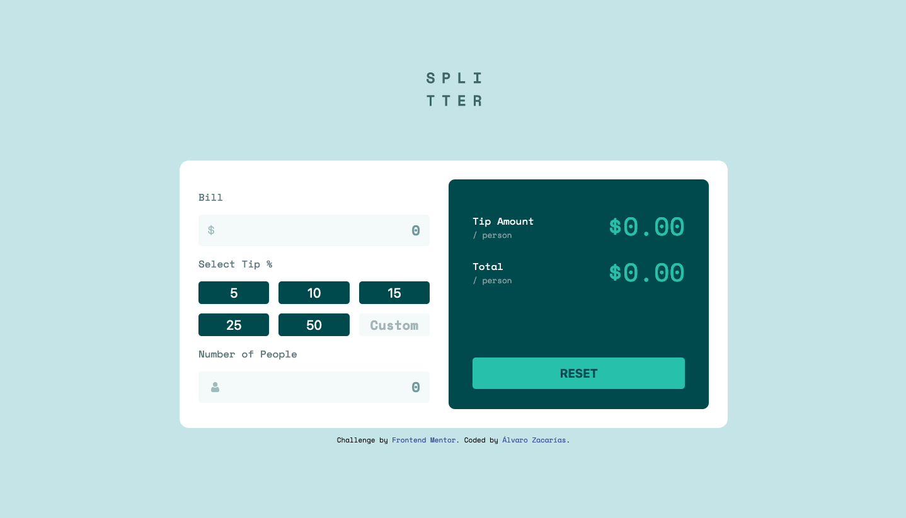
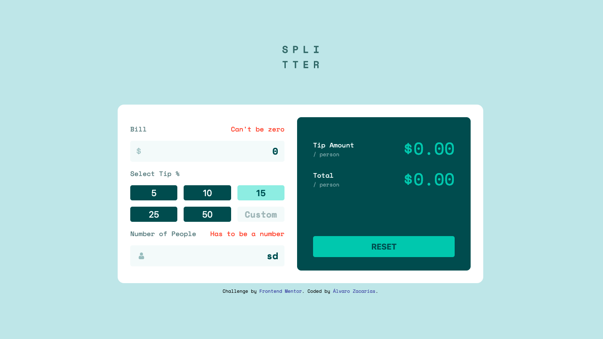
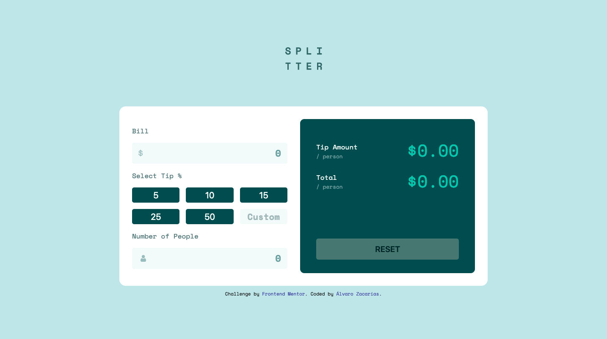

# Frontend Mentor - Tip calculator app solution

This is a solution to the [Tip calculator app challenge on Frontend Mentor](https://www.frontendmentor.io/challenges/tip-calculator-app-ugJNGbJUX). Frontend Mentor challenges help you improve your coding skills by building realistic projects.

## Table of contents

- [Overview](#overview)
  - [The challenge](#the-challenge)
  - [Screenshot](#screenshot)
  - [Links](#links)
- [My process](#my-process)
  - [Built with](#built-with)
  - [What I learned](#what-i-learned)
  - [Continued development](#continued-development)
- [Author](#author)

## Overview

### The challenge

Users should be able to:

- View the optimal layout for the app depending on their device's screen size
- See hover states for all interactive elements on the page
- Calculate the correct tip and total cost of the bill per person

### Screenshot

### Links

- Solution URL: [https://github.com/alvarozama/Tip-calculator-app]
- Live Site URL: [https://alvarozama.github.io/Tip-calculator-app/]

## My process

### Built with

- Semantic HTML5 markup
- CSS custom properties
- Flexbox
- CSS Grid

### What I learned

I cannot really say I learned much this time around. On the styling side of things this wa pretty good practice. However, when it comes to the behavior side, I was barely able to build a half-functioning app and ended up pretty frustrated for not being able to fix the things I know are wrong with my code.

### Continued development

I'd like to focus more on the things I was unable to accomplish succesfully. For example, the fact that the selecte percentage buttons don't become de-selected when clicking on a different one o the fact that the app only works when clicking on a percentage button and not when changing the input values in real time. 

## Author

- Frontend Mentor - [@alvarozama](https://www.frontendmentor.io/profile/alvarozama)

